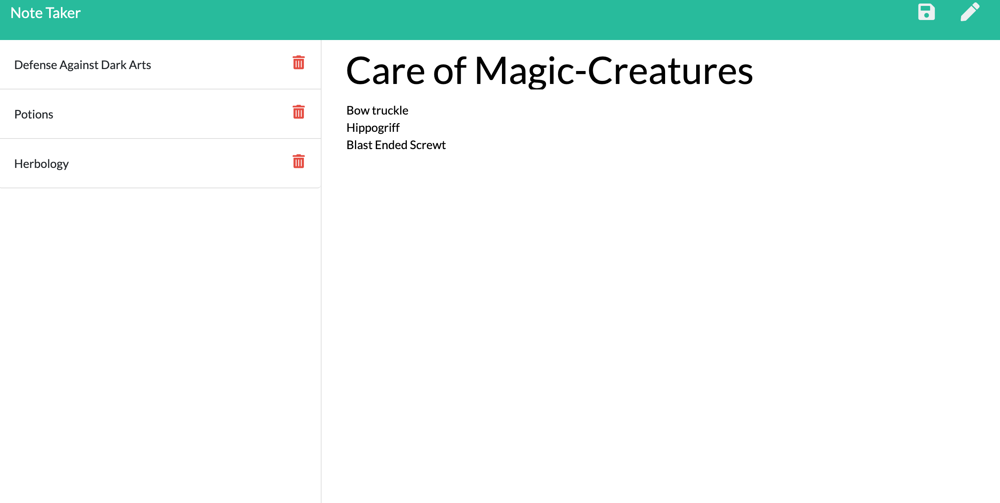
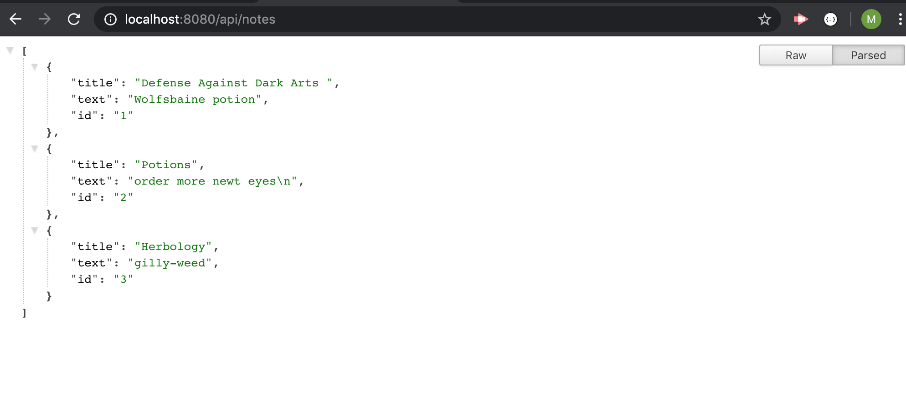

# Note-Taker-App
This web application allows users to write notes in a clean, user freindly format. 
Users can create a title for thier notes, write down the content, save notes, and delete 
previously saved notes.

## 
This project was created for unit 11 of the JHU Full-Stack Bootcamp. The material covered in this unit 
included:
* http
* Express.js
* Routing
* Postman
* HTTP POST requests
* Express.static()

For this project, the front end was provided and the main goal was to write code for the server and the HTML AND API Routes. 
## Description
<a href="https://peaceful-gorge-92743.herokuapp.com/" target="_blank"> Deployed Link </a>

